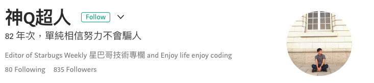
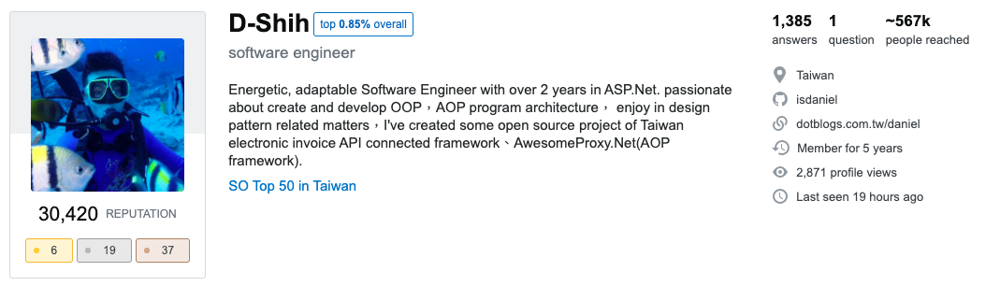

## 陳毅｜IAN 

> 目前就讀於國立臺北科技大學電子工程系 - 計算機工程組。
>
> 現職為 Intern @Robert Bosch - Product Quality Improvement (Business Segment Installed Audio)。

### Awards

- 2020
  - KKBOX Hackathon 2020 - 第一名 [1]
  - IT 幫鐵人賽 2020 - 進行中...
  - 校內學生學術性競賽成績優良獎學金 [5]
- 2019
  - 成大 ITSA GEEK - 晉級決賽 [3]
  - IT 幫鐵人賽 2019[4] - 鐵人練成獎、經由六角學院認證
  - 台達電子獎助學金

### Conference & Research

- Shin-Ting Wu, Yi Chen, Chen-Yo Liao and Po-Chun Huang. "A Blockchain-based Paper Managemant System to Protect the Academic Ethics"
- 投稿科技部大專生研究計畫 [7]

### Work Experience

- Intern @友嘉實業 - 資訊部

  - 資訊設備維護、疑難雜症排除
- Intern @馬唯科技

  - 電路板檢修
- Intern @Robert Bosch - Product Quality Improvement

  - 聯絡世界各地的維修單位取回故障品
  - 檢測故障品及分析潛在故障原因
  - 與供應商進行產品改良會議

> 提早進入職場讓我比起同儕更具抗壓性，面對問題時能夠冷靜分析、有效針對不同的環節做危機處理。
>
> 也因為在職場待過，我更加確定自己要的是什麼並且付出實際行動努力追求與實踐。

> 我深信提早進入職場會讓我相較於同儕更具抗壓性、面對問題時能夠迎刃而解，也因為具備職場經驗，我更能確定未來方向且付出實際行動、實現目標。

### Activities

> 大學生涯中，除了在學校修課、企業實習，也會利用課餘時間參加一些資訊相關的社群活動。從會眾到成為社群活動的工作人員、參與投稿，在講台上與會眾分享自己所熱衷的技術和知識。......感想

- 社群參與
  - SITCON 2020 - 講者 [6]

  - COSCUP 2020 - 工作人員

  - JSDC 2019 - 與會者

  - GDG DevFest Taipei 2019 - 與會者

  - F2E&RGBA Meetup - 與會者

  - 0x1 Academy 區塊鏈微學程

  - AIoT 遠端監控居家安全工作坊
  - Microsoft 一日實習生

>  此外，我也受到【費曼學習法】影響，喜歡透過「分享 」的方式，讓我可以從中學習如何歸納及整理既有的知識。

- 程式讀書會
  - Web 技術讀書會
- Others
  - 市立內湖高工社團<水漾康輔社> - 106學年度校外指導老師

  - AIHub 一日機器學習營 - 程式助教

### Score

- Rank in Class: 18/57 (31.5%)
- Overall GPA: 3.15
- last 60 credits: 3.5
- junior / senior GPA: 3.53

> 從大一至大三一共6個學期，班排分別為:`45`, `41`, `12`, `8`, `16`, `9`。
>
> GPA也呈現出穩定成長的趨勢。

### 業界人士推薦

樂於挑戰、分享、學習新技術以及未知的知識，讓我結識到很多來自業界的專業人士。

比起普通學生，我有更豐富的工作、開發實務經驗以及更多的業界人脈，讓我在評估專題實驗的可行性時，可以從更多面向做詢問、參考和判斷。

- <h5 style="">Eddie - 專案經理@美商訓能集思</h5>

  <h5 style="display:inline;">我</h5>是 Eddie，畢業於北科大電子工程所， 目前就職於美商訓能集思，職位是專案經理， 會認識到陳毅是因為他曾報名參加北科的 CNN 圖像辨識課， 他是	一位用功且願意嘗試新技術的學生， 及他也時常報名各類型的演討會與校外晉升活動， 若有機會被貴校的研究所錄取，一定能成為堅強的戰力之一。

- <h5 style="display:inline;">神Ｑ超人 - MOPCON 講者, 前端工程師, Medium 知名專欄寫手</h5>

  

  <h5 style="display:inline;">我</h5>是神 Q 擔任前端工程師四年左右，因為平時有在網路上分享技術文章，而當時毅他聯絡了我，詢問一些關於程式上的問題，那時候覺得他對於程式語言有相當大的熱情。

  雖然有時也會像其他初學者一樣對自己學的語言或框架感到不確定性，但毅不會讓自己一個人孤軍奮鬥，他總能歸納好問題後向身邊的朋友們提出，因此我認為更難能可貴的是他擁有自發性解決問題的能力，讓自己在程式之路上不斷進步。

- <h5 style="display:inline;">Daniel - ITC 工程師@軒昂</h5>

  

  <h5 style="display:inline;">我</h5>是 Daniel, 在軒昂擔任 ITC 工程師，我推薦毅的原因是之前跟他合作參加 It 邦幫忙鐵人賽毅展現出對於技術的熱情跟能力讓我印象深刻，我鮮少看到有學生這麼積極參與校外技術活動。

### Projects

- <h5 style="">基於機器學習的全方位課堂學生表現紀錄系統 (大學專題)</h5>

  > 結合機器學習、圖像辨識技術並整合網頁全端開發出一套可商業化的系統方案。

- <h5 style="">Blockchain Paper Submission System (論文實驗)</h5>

  > 撰寫"A Blockchain-based Paper Managemant System to Protect the Academic Ethics"之實驗，該實驗基於 Hyperledger Fabric [2]、 利用其 SDK 撰寫智能合約以及開發出全端應用。

- <h5 style="">MusicToghether</h5>

  > 此為 KKBOX Hackathon 之得獎作品，主要使用 Vue.js 開發出一個具有搜尋功能的試聽應用。（串接 KKBOX OPEN API (OAuth 2.0) 和 Youtube Search API ）

- <h5 style="">基於 SocketIO 實作匿名隨機配對聊天室</h5>

  > 利用 SocketIO 套件開發一款功能類似於 WooTalk 的線上匿名配對聊天室。

- <h5 style="">以太坊上的打卡獎勵機制</h5>

  > 參加由圖靈鏈執行長 - Jeff Hu、北科大互動設計系教授 - 寶博士所開設的 0X1 Academy 所產出的專案。
  >
  
- <h5 style="">MarkDown Editor (開發中)</h5>

  > 受到 HackMD, Typora 等等 MarkDown 編輯器啟發，希望能夠開發出一套更完善的編輯器。

<h3 style="display:inline;">最</h3><h5 style="display:inline;">後，我也樂於參與開源貢獻，像是對 Hyperledger, SITCON 等專案發起 Issue, Pull Request、協助翻譯 Mozilla 所開源的 MDN Web Docs [8]。</h5>

### Reference

1. KKBOX Hackathon, [link](https://innovation.kktix.cc/events/vote-the-works-2020)
2. Hyperledger Fabric, [link](https://www.hyperledger.org/use/fabric)
3. ITSA Geek, [link](https://www.facebook.com/itsageekcontest/)
4. IT邦幫忙鐵人賽, [link](https://ithelp.ithome.com.tw/2020-12th-ironman/event)
5. 校內學生學術性競賽成績優良獎助金, [link](https://mmre.ntut.edu.tw/p/406-1074-99796,r50.php?Lang=zh-tw)
6. SITCON2020-關於我, [link](https://sitcon.org/2020/agenda/cca72fad-3577-46d0-a7af-966bc72e0fc1?popUp=announcement)
7. 大專生研究計畫提案書, [link](https://github.com/ianchen0119/MosProposal/blob/master/大專生研究計畫提案書.pdf)
8. My Github, [link](https://github.com/ianchen0119)

