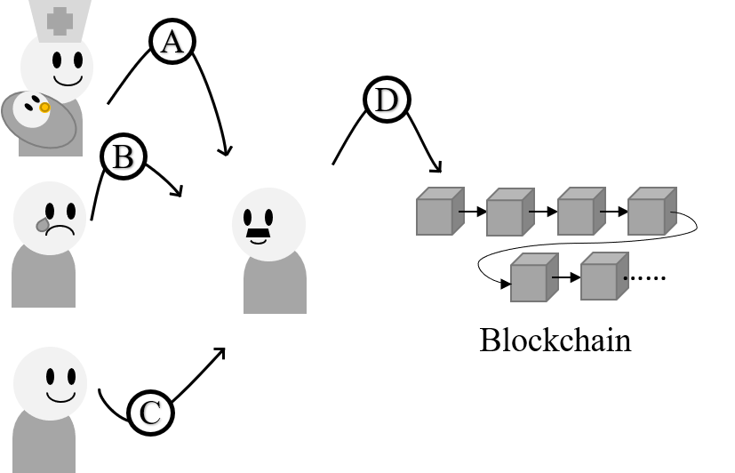

# 碩士學程研究計畫

## 摘要

從**拜占庭問題** [1]到中本聰所提出的**比特幣白皮書** [2]，世人開始對這個奇妙的分散式系統架構有了新的認知並將其統稱為**區塊鏈**。在比特幣 [3]中的創世區塊誕生至今的 10 餘年間，從早期用於**暗網** [4]交易進而引起挖礦風潮，再到區塊鏈技術的開枝散葉，如: 以太坊 [5]、狗狗幣 [6]、波場幣 [7]以及在台灣發跡並快速崛起的新創公司: 圖靈鏈 [8]...等。大家都試著利用分布式帳本嘗試解決不同問題。

像是圖靈鏈執行長最初是希望能夠利用數位證書去解決申請海外研究所時遇到: 履歷認證過於耗時的問題。而以太坊創辦人一開始是希望比特幣能夠發展出完整的程式語言以供開發者使用，遭到拒絕後才將方向轉為打造自己的區塊鏈。這些區塊鏈的前輩之所以能獲得成功，皆是出於其擁有**解決問題**的強烈動機。

在台灣土生土長的我，享受民主帶來的便利。也因為民主賦予人民的權利，各位國民都有義務參與選舉等公眾事務。在 2018 年的 9 合 1 市長選舉，因為與公投合並舉辦，導致**一邊開票，一邊投票**的亂象發生。透過該事件，便讓我開始思考: 要如何利用資訊技術降低公眾投票所需要的人力以及時間成本。一開始，我對於如何找出問題的答案並沒有具體的想法，直到在實驗室參與區塊鏈技術的相關研究時，我才驚覺: 或許這就是該問題的最佳解答。

在我的碩士論文中，我希望從**投票活動的資訊化**作為出發點，設計出完整的身分驗證機制，從遠而近的將投票活動資訊化、數位身分證、戶政資料登記的詳細流程設計出來。熱衷於實作的我，更希望自己能在碩士研讀期間實作出完整的系統原型。

## 系統架構與動機

以 2018 年的 9 合 1 市長選舉為例，因為與公投議題較往年更為特別並且在公投書的設計上有不易閱讀等疏失，進而導致**一邊開票，一邊投票**的亂象發生。起初，我雖希望能夠**利用資訊技術降低公眾投票所需要的人力以及時間成本**，不過在當時並沒有太具體的實現方式。直到在實驗室參與區塊鏈技術的相關研究並學習使用 `Hyperledger - fabric` 配合網頁開發技術實現研究原型時，我才驚覺: 或許區塊鏈能夠有效解決這個問題。也因為投稿過科技部大專生研究計畫，讓我對於方向探索更有心得，對於問題的解答有初步方向後，我也開始閱讀相關的技術文獻，包含:

- 比特幣白皮書
- Using blockchain for enabling internet voting
- BLOCKCHAIN FOR THE HUMANITARIAN SECTOR: FUTURE OPPORTUNITIES
- Medical Record System Using Blockchain, Big Data and Tokenization

在閱讀相關文獻後發現在學術界中已經有人嘗試利用區塊鏈技術解決公民投票的問題。不過，我也發現該研究並沒有對如何落實政策以及實際應用產生的問題進行更深的探討。

<?-- 塞個架構圖 QQ --?>

因此，在我的碩士論文中，我希望從**投票活動的資訊化**作為出發點，設計出完整的身分驗證機制，從遠而近的將投票活動資訊化、數位身分證、戶政資料登記的詳細流程設計出來。此外，熱衷於實作的我，期望自己能在碩士研讀期間實作出完整的系統原型。

整個資訊系統共包含了:

- 區塊鏈主網路

  可以考慮使用由 `Linux Foundation` [8]所主導的 `Hyperledger-fabric` [9]作為區塊鏈網路主體或是自行設計一套簡易的區塊鏈網路。

- 可靠節點

  本系統機制不以單一國民作為節點，而是以地方戶政機關作為節點，這樣一來，能夠採用較為節省效能的權威證明共識機制 (Proof-of-Authority, PoA) [10]以及將節點控制在一定的數量。

- 註冊與註銷身分

  若以 `Hyperledger-fabric` 作為區塊鏈主網路，便可以藉由其官方提供的 SDK [11]開發出註冊與註銷身分的資訊系統供醫院以及有關單位使用。
  
- 中央 API (Application Programming Interface, API)

  

## 初步構思

</img>

#### 圖二、 身分註冊流程圖

- 身分註冊、身分驗證機制

  - Case A: 孩童出生
    1. 由醫院、婦產科利用身分註冊系統發起身分登記請求 (交易請求)。
    2. 交易會被提交到可靠節點 (地方戶政機關)進行驗證。
    3. 經過節點驗證以後會返回交易編號給發起交易的機構，並且將交易資訊新增到帳本中。
    
  - Case B:人民死亡
    1. 由相關單位發起註銷身分請求 (交易請求)。
    2. 交易會被提交到可靠節點 (地方戶政機關)進行驗證。
    3. 經過節點驗證以後會返回交易編號給發起交易的機構，並且將交易資訊新增到帳本中。
    
  - Case C: 政策落實前出生的國民

    回到現實層面，要將國內人口全數換發成數位化身分登記是非常困難的，因此本研究將政策落實分為兩階段:

    ### 輔導階段 ~ 30年

    可根據戶政機關既有的資料庫，額外新增一筆紀錄有無登記新數位身分的欄位，並且透過需要實名制度的活動將尚未登記的國民納入管理，舉例:

    - 進入小學階段前:
      - 就醫時透過健保系統進行驗證並協助身分登記。
      - 國民小學入學時，透過學校統一進行身分登記。
    - 小學、國高中、五專二技及大專院校就讀中
      - 就醫時透過健保系統進行驗證並協助身分登記。
      - 透過學校統一進行身分登記。
      - 符合參與選舉、公投身分者，在進行投票前協助身分登記。
    - 就業國民
      - 申報所得稅時，協助進行身分登記。
      - 透過勞保系統，要求資方協助勞方登記。
      - 就醫時透過健保系統進行驗證並協助身分登記。
      - 符合參與選舉、公投身分者，在進行投票前協助身分登記。
    - 待業、退休國民
      - 就醫時透過健保系統進行驗證並協助身分登記。
      - 領取退休金、失業給付等相關社福措施時協助身分登記。
      - 符合參與選舉、公投身分者，在進行投票前協助身分登記。

    ### 強制落實階段

    - 過戶政資訊系統查詢尚未登記人口並實行強制登記輔導。
    - 將**輔導階段**小節提到的方法，全面轉為強制登記。

    

- 投票活動資訊化

- 可延伸的方向

## 預計時間表

- 階段一
- 階段二
- 階段三

## 參考資料

1. 拜占庭問題
2. 比特幣白皮書
3. 暗網
4. 以太坊
5. 狗狗幣
6. 波場幣
7. 圖靈鏈
8. Linux Foundation
9. Hyperledger-fabric
10. 權威證明

- Using blockchain for enabling internet voting
- BLOCKCHAIN FOR THE HUMANITARIAN SECTOR: FUTURE OPPORTUNITIES
- Medical Record System Using Blockchain, Big Data and Tokenization